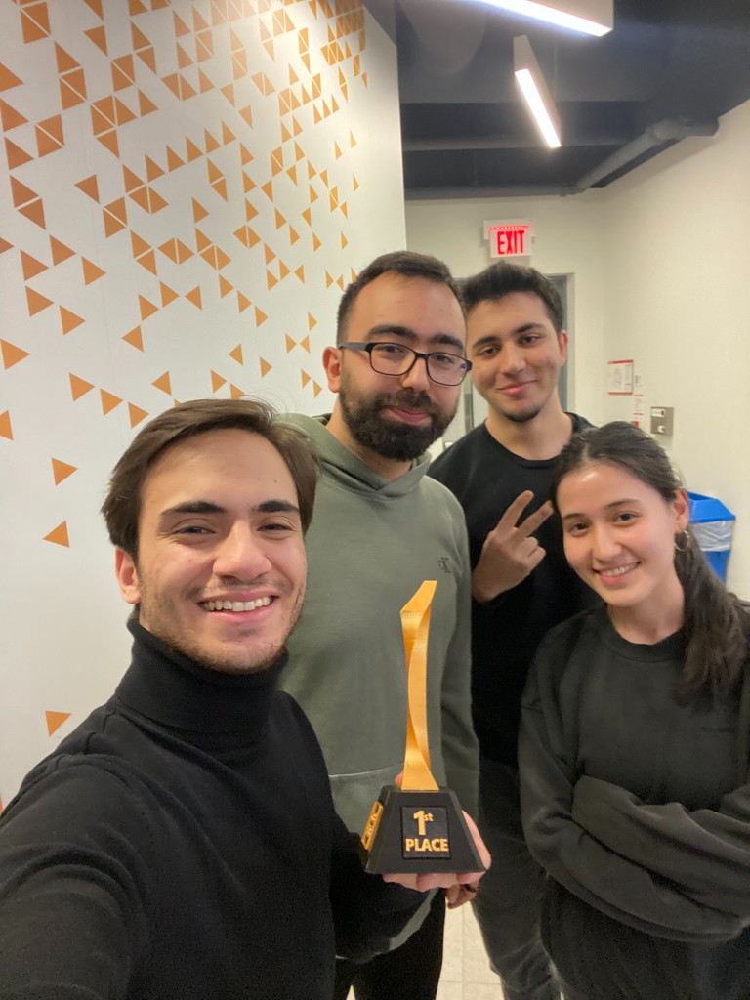

# LassondeRoborama
Lassonde Roborama, was a 6 hours long Hackathon which competitors needed to design, build and code an arduino robot that can follow a line. The winner was selected on timer, meaning that the robot needs to be fast and stay on the track.

<h2>Meet the Team </h2>

<h2>Video Demonstration </h2>

